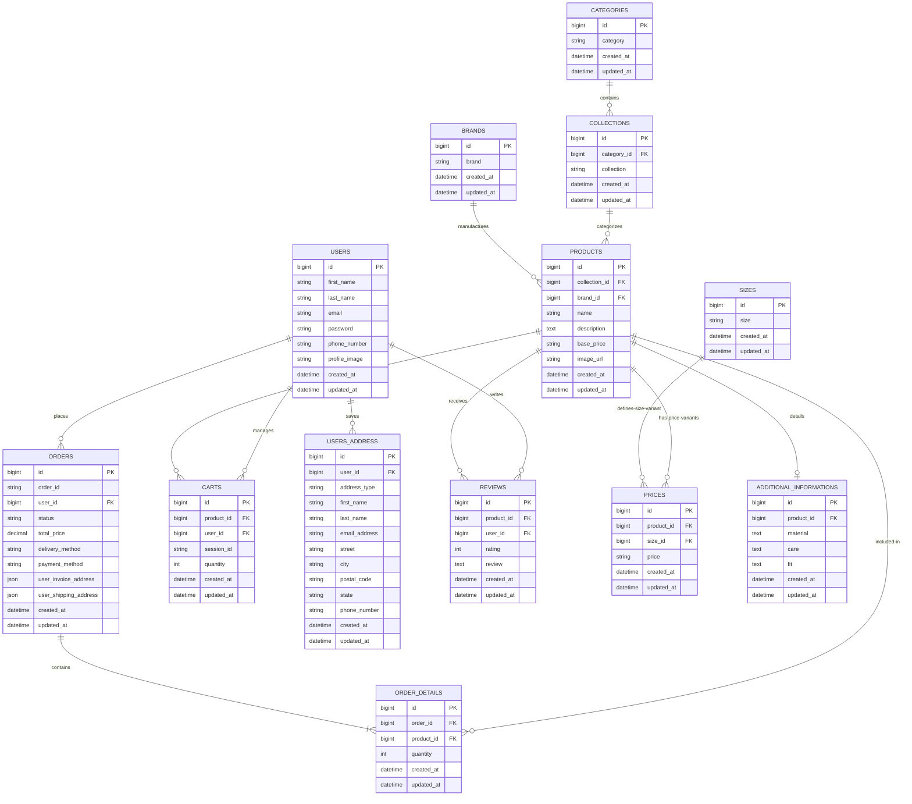

# 🛍️ ClothesHub - Fashion E-Commerce Platform

[](https://laravel.com)
[](https://php.net)
[](https://getbootstrap.com)
[](https://mysql.com)
[](https://render.com)

ClothesHub is an industry-grade, feature-rich fashion e-commerce web application engineered with **Laravel 12**. The platform provides customers with an interactive, responsive online shopping experience, featuring dynamic cart management, state-of-the-art address verification, robust guest security routing, and an aesthetic user interface.

---

## 🌐 Live Demo

🔗 **Website:** [https://clotheshub-cl0e.onrender.com](https://clotheshub-cl0e.onrender.com)

---

## 📖 Key Project Features

### 🛒 E-Commerce & Cart Engine
- **Session-Based Cart**: Cart operations sync between authenticated user records and anonymous session IDs.
- **Maximum Purchase Limits**: Enforces a strict 100-quantity purchase limit per product to mitigate checkout exploits.
- **Guest Access Control**: Restricts cart views and checkout operations to logged-in users, redirecting guests to the authentication screen with alerts.
- **Header Cart Badge & Dropdown Preview**: Provides real-time cart counts and an interactive dropdown list to preview items and remove them instantly.

### 💳 Checkout & Order Processing
- **Indian Postal Zone Verification**: Dynamic validation of 6-digit Indian PIN codes based on selected states (e.g., verifying Bihar/Jharkhand pincodes begin with `8`).
- **Dynamic Tax & Shipping Estimates**: Automatically calculates tax at 10% and shipping at 2% of the order subtotal.
- **Conditional Shipping Address**: Order billing records automatically default to the invoice address unless "Use different shipping address" is toggled and supplied.
- **Order Cancellation**: Customers can cancel orders in `pending` status, accompanied by a premium confirmation modal.

### 👤 Profile & Security Controls
- **Interactive Account Deletion**: Users can delete accounts securely via a themed modal, cascading deletion across related profiles, addresses, carts, and order details.
- **Post-Auth Redirection**: Streamlines user journeys by redirecting users directly back to the homepage upon login or registration.

---

## 🏗️ Technical Architecture & Stack

### Backend
- **Framework**: Laravel 12
- **Language**: PHP 8.2+
- **Architecture**: Model-View-Controller (MVC) with custom Eloquent accessors/mutators and database transactions.

### Frontend
- **Templating**: Laravel Blade
- **Styling**: Vanilla CSS, Bootstrap 4.6 (responsive grid, utility classes)
- **Icons**: FontAwesome & Custom SVG Icons
- **Interactive Logic**: Vanilla JavaScript & jQuery for animations, form validations, and asynchronous modal toggles.

### Database
- **Engine**: MySQL / PostgreSQL (Neon)
- **Schema Casts**: Uses Eloquent array-casting for structured address JSON storage inside order objects to guarantee auditability even when profile details change.

---

## 📂 Project Directory Structure

```bash
ClothesHub
│
├── app/
│   ├── Http/
│   │   ├── Controllers/    # Cart, Auth, Checkout, and Profile Controllers
│   │   └── Middleware/     # Authenticated user routing guards
│   └── Models/             # Eloquent Models (Order, Cart, Product, Address, etc.)
│
├── database/
│   ├── migrations/         # Database structural history and schema modifications
│   └── seeders/            # Database mock content population
│
├── public/                 # Assets (CSS, JS, images, icons)
├── resources/
│   └── views/              # Blade Views (Shop, Cart, Account, Checkout, Order Details)
│
├── routes/
│   └── web.php             # Core application routing definitions
│
├── tests/                  # Feature and Unit tests
├── composer.json           # PHP composer configuration
└── README.md
```

---

## ⚙️ Quick Start & Installation

Follow these steps to configure ClothesHub locally on your machine:

### 1. Clone the Repository
```bash
git clone https://github.com/adityadhanraj12/clotheshub.git
cd clotheshub
```

### 2. Install Dependencies
```bash
composer install
npm install
```

### 3. Setup Configuration
```bash
cp .env.example .env
```
Generate the Laravel APP_KEY:
```bash
php artisan key:generate
```

### 4. Configure Database Credentials
Open the `.env` file and set up your MySQL or PostgreSQL database details:
```env
DB_CONNECTION=mysql
DB_HOST=127.0.0.1
DB_PORT=3306
DB_DATABASE=clotheshub
DB_USERNAME=root
DB_PASSWORD=YOUR_PASSWORD
```

### 5. Run Migrations & Seeders
```bash
php artisan migrate
php artisan db:seed
```

### 6. Spin up Server
```bash
php artisan serve
```
Visit the local server in your browser: `http://127.0.0.1:8000`

---

## 🗄️ Core Database Schema



---

## 🚀 Deployment

This application is optimized for deployment on cloud platforms like **Render**, **Heroku**, or standard **Linux VPS** instances:
- Set up automation on pushing to your `main` branch.
- Execute migrations during the build step: `php artisan migrate --force`.
- Ensure standard PHP 8.2+ dependencies are met on the target server.

---

## 👨‍💻 Developer & Authorship

### Aditya Dhanraj
- ✉️ **Email**: [adityadhanraj404@gmail.com](mailto:adityadhanraj404@gmail.com)
- 🔗 **LinkedIn**: [Aditya Dhanraj](https://www.linkedin.com/in/aditya-dhanraj555)